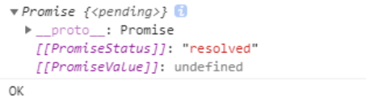

# 1.ES6简介

ECMAScript 6.0（以下简称 ES6），其实就是javascript这门语言的标准化规范。因为由ECMA国际标准化组织指定，就叫做ECMAScript。

ECMAScript 和 JavaScript 的关系是，前者是后者的规范，后者是前者的一种实现。

[Babel](https://babeljs.io/) 是一个广泛使用的 ES6 转码器，可以将 ES6 代码转为 ES5 代码，从而在老版本的浏览器执行。

# 2. let与const

**在es6中，引入了let和const关键字；**

**let关键字是用来取代var的；**

**let作用，与var类似，用于声明一个变量**


**1.在一个大括号中，使用let关键字声明的变量才具有块级作用域，var不具备这个特点**

```
if(true) {
  var b = 'lisi'
  let a = 'zhangsan'
}
console.log(b)
console.log(a)
```


**2，不能重复声明**

```
{
  let a=1;
  let a=2;
  console.log(a);
}
```


**3  let不存在变量提升**

 

```

console.log(b)    //undined
  var b = 'lisi'

  console.log(a)    //报错
  let a= 'zhangsan'
```


**4.块级作用域let变量具有暂时性死区特性**

```
var a = 30
if(true) {
  console.log(a)
  let a = 60
}
```


**5.防止循环遍历变成全局变量**

```
var arr = []
  for(var j = 0;j<20;j++) {
      arr[j] = function() {
        console.log(j)
      }
  }
  arr[0]()
  arr[10]()

  var arr1 = []
  for(let i = 0;i<20;i++) {
    arr1[i] = function() {
      console.log(i)
    }
  }
  arr1[0]()
  arr1[10
```


**const定义的变量，不可改变，其他特性和let一样；**


# 3.对象解构赋值

**数组，对象解构赋值**

```
<!DOCTYPE html>
<html>
<head>
  <meta charset="UTF-8">
  <title>Title</title>
</head>
<body>
<script type="text/javascript">
  let obj={username:'zhangsan',age:18};
  /*let username=obj.username;
  let age=obj.age;*/
  let {username,age}=obj;
  console.info(username,age);

  function func({username: myUserName,age: myAge}){
    // console.info(obj.username,obj.age);
    console.info(myUserName,myAge);
  }
  func(obj);
  
  let arr=[1000,2000,3000,'你是最棒的',true];
  let [a,b,c,d,e] = arr;
  console.info(a,b,c,d,e)
  
</script>
</body>
</html>
```


# 4.对象简写

**es6提供了对象定义里的属性，方法简写方式；**

**我们来看个实例，首先定义两个属性，然后再定义一个对象，里面用到属性赋值，以及再定义一个对象方法；**

es6之前的写法：

```
<!DOCTYPE html>
<html>
<head>
  <meta charset="UTF-8">
  <title>Title</title>
</head>
<body>
<script type="text/javascript">
  let name ='zhangsan';
  let age = 20;
  let obj = {
    name: name,
    age: age,
    getNameAndAge:function(){
      return this.name + "的年龄是：" + age;
    }
  };
  console.log(obj);
  console.log(obj.getNameAndAge());

</script>
</body>
</html>
```

es6简写方式，假如属性和变量名一样，可以省略，包括定义对象方法function也可以省略；

```
<!DOCTYPE html>
<html>
<head>
  <meta charset="UTF-8">
  <title>Title</title>
</head>
<body>
<script type="text/javascript">
  let name ='zhangsan';
  let age = 20;
  let obj = {
    name,
    age,
    getNameAndAge() {
      return this.name + "的年龄是：" + age;
    }
  };
  console.log(obj);
  console.log(obj.getNameAndAge());
</script>
</body>
</html>
```


# 5.es6模板字符串

es6 模版字符串主要用于简化字符串的拼接；

```
<!DOCTYPE html>
<html lang="en">
<head>
  <meta charset="UTF-8">
  <title>ES6模板字符串</title>
  <script type="text/javascript">
    //es6之前写法
    let obj={name:'zhangsan',age:'18'};
    let str='姓名：'+obj.name+'，年龄：'+obj.age;
    console.log(str);

    //es6之后写法
    let str1=`姓名：${obj.name}，年龄：${obj.age}`;
    console.log(str1);
  </script>
</head>
<body>

</body>
</html>

```


# 6.箭头函数

es6推出了一个新语法：箭头函数

（1）第一种情况

es6之前普通函数定义

```
let fun1 = function() {
  console.log('我是普通函数');
};
let fun1 = function() {
  console.log('我是普通函数');
};

```

es6箭头函数

let fun1 = () => {console.log('我是箭头函数')};

假如函数体只有一条语句或者是表达式的时候{}可以省略

let fun1 = ()=>console.log('我是箭头函数');


（2）第二种情况

普通函数

1个形参情况

```
let fun2 = function(x) {
  console.log('我是普通函数');
};
```

箭头函数

let fun2 = (x)=>console.log(x);

只有一个形参的时候 ()可以省略

改成：

let fun2 = a => console.log(a);


（3）第三种情况

多个形参有返回值

let fun3 = (x,y) => {

​	console.log(x,y);

​	return x+y;

}


（4）箭头函数里面的this指向

箭头函数没有自己的this，箭头函数的this不是调用的时候决定的，而是再定义的时候所在的对象就是它的this

箭头函数的this看外层是否有函数，

如果有，外层函数的this就是内部调用箭头函数的this 

如果没有，则this是window

注意：

1. =>不能作为构造函数来使用（因为没有this）
2. call、apply、bind无效（因为没有this）
3. 没有arguments对象（因为与function不是同一类型函数，用拓展运算符代替）
4. 箭头函数不适合做对象的方法，不适合做回调函数

```
<!DOCTYPE html>
<html lang="en">
<head>
  <meta charset="UTF-8">
  <title>es6箭头函数</title>
</head>
<body>
  <button id="btn1">第一个按钮</button>
  <button id="btn2">第二个按钮</button>
  <button id="btn3">第三个按钮</button>

  <script type="text/javascript">
    function fun1() {
      console.log(this)
    }
    fun1()  //window
    let btn1=document.getElementById('btn1');
    let btn2=document.getElementById('btn2')
    let btn3=document.getElementById('btn3')
    btn1.onclick=function(){
      console.log(this);   //调用点击事件的对象btn1
    };
    btn2.onclick = ()=>{
      console.log(this);   //window
    }

    let obj1 = {
      name: 'zhangsan',
      age: 18,
      printInfo:function() {
        btn1.onclick = ()=> {
          console.log(this);  //obj1
        }
      }
    }
    obj1.printInfo();

    let obj2 = {
      name: 'lisi',
      age: 20,
      printInfo:function(){
        btn2.onclick = function(){
          console.log(this)  //btn2
        }
      }
    }
    obj2.printInfo();

    var name = 'wangwu'
    let obj3 = {
      name: 'lisi',
      age: 20,
      printInfo:()=> {
        btn3.onclick = ()=> {
          console.log(this.name)  //wangwu
        }
      }
    }
    obj3.printInfo();
  </script>
</body>
</html>

```


实际场景：点击div，3秒之后变红

```
<!DOCTYPE html>
<html lang="en">
<head>
  <meta charset="UTF-8">
  <title>es6箭头函数</title>
</head>
<body>
  <div id="div1" style="width: 300px;height: 300px;border:solid 1px #1E9FFF;">变红</div>

  <script type="text/javascript">
    let div1=document.getElementById('div1');
    /*div1.onclick = function(){
      setTimeout(function() {
        this.style.background = 'red'
      },3000)
    };*/
    div1.onclick = function() {
      setTimeout(() => {
        this.style.background = 'red'
      }, 3000)
    }
  </script>
</body>
</html>
```


# 7.函数默认值

```
<!DOCTYPE html>
<html lang="en">
<head>
  <meta charset="UTF-8">
  <title>es6函数默认值</title>
  <script type="text/javascript">
    function fun1(x,y=10) {
      console.log(x+y)
    }
    fun1(1,2)  //3
    fun1(1)  //11
    
    function fun2({name = 'zhangsan',age}) {
      console.log(name,age)
    }
    fun2({name: 'lisi',age: 18})   //lisi 18
  </script>
</head>
<body>

</body>
</html>
```

# 8.Rest参数

注意点：rest参数需要放到最后

```
<!DOCTYPE html>
<html lang="en">
<head>
  <meta charset="UTF-8">
  <title>es6中Rest参数</title>
  <script type="text/javascript">
    function fun1(x,y,...params) {
      console.log(x,y,params)
    }
    fun1(10,20,30,40,50,60)
  </script>
</head>
<body>

</body>
</html>
```


# 9.模块化

**1.node.js遵循了CommosJs的模块化规范。导入模块使用require() ,导出模块module.exports对象**

**下面是js社区开发者提出的模块化规范**

**浏览器端的js模块化规范： AMD和CMD**

**服务端的js模块化规范:  CommonJS**

**上面这些模块化存在一定的局限性和差异性，不是浏览器和服务器端通用的模块化标准，为此官方在es6中推出了浏览器和服务器端统一的模块化规范，降低学习成本。**


2.**ES6模块规范如下:**

**每个js文件是一个独立的模块**

**使用import关键字导入其它模块成员**

**使用export关键字导出自己模块的成员**


3.ES6的模块化包含以下三种用法：

（1）默认导入和导出

（2）按需导入和导出

（3）直接导入并执行导入的模块中代码


(4)默认导入和导出

export default 

```

//demo1.js
let a = 1  //a和b，eat方法是模块内私有变量和方法，外部js或者vue等文件需要导入才能使用
let b = 2
function eat() {
  console.log("你吃了吗")
}

export default {
  a,
  b,
  eat
}
```


```
//demo2.js
import demo1 from './demo1.js'   //demo1是合法名称  
console.log(demo1.a)  //1
console.log(demo1.b)   //2
console.log(demo1.eat)   
```


注意点：

导入名称没有特别要求，只不过要合法

每个模块中，只允许默认导出一次，否则报错


(5) 按需导入和导出

```
//demo1.js
export let a = 1
export let b = 2
let c = 3
let d = 4
let e = 5
export function eat() {
  console.log("你吃了吗")
}

export {
    d as dd,
    e as ee
}

export default {
  c
}


```


```
//demo2.js
import defaultObj {a,eat as eatFood,dd,ee} from './demo1.js'
console.log(a)
console.log(eatFood())
console.log(defaultObj.c)

//第二种方式：
一次性把所有demo1.js中导出来的成员导入进来作为对象里面的属性
import * as newObj from './demo1.js'
console.log(newObj.a)
console.log(newObj.eat())

```

**注意点：**

**每个模块中可以多次使用export按需导出**

**按需导入成员名称必须和按需导出名称一致**

**按需导入，可以对导入的成员名称重命名**

**默认导入和按需导入可以在同一个模块一起使用**

**可以使用*一次性导入**


**（6）直接导入并执行模块中的代码**

**只是为了执行导入的模块代码，不需要获取导入模块的成员时，可以使用**

```
//demo1.js
console.log("我是中国人")
console.log("来自湖南")
```

```
//demo2.js
import './demo2.js'   //我是中国人  //来自湖南

```


# 10.Symbol

## （1）基础知识

ES6 引入了一种新的原始数据类型`Symbol`，表示独一无二的值。它属于 JavaScript 语言的数据类型之一，其他数据类型是：`undefined`、`null`、布尔值（Boolean）、字符串（String）、数值（Number）、大整数（BigInt）、对象（Object）。

引入Symbol的原因：ES6之前的对象属性名都是字符串，这容易造成属性名的冲突。比如说你引入一个同事写的js代码，你往他js代码里面一个很复杂的对象里面添加新的属性方法，如果是用属性名还是使用字符串的方式，你加的方法就有可能和你同事加的方法重名了。ES6引入Symbol类型让对象的属性名可以有两种类型，一种是原来就有的字符串，另一种就是新增的 Symbol 类型。凡是属性名属于 Symbol 类型，就都是独一无二的，可以保证不会与其他属性名产生冲突。

注意：Symbol它是一种类似于字符串的原始数据类型，不是对象，不能使用new关键字，Symbol 值通过`Symbol()`函数生成。

```javascript
let a = Symbol();
typeof a
// "symbol"
```

`Symbol`函数可以接受一个字符串作为参数，其实就是对Symbol 实例的描述，来达到对不同Symbol 实例的区分。

```
 let a = Symbol('foo');
 console.log(a)  //输出Symbol   Symbol(foo)
 
 console.log(a.toString)  //输出字符串 "Symbol(foo)"
 
 //如果 Symbol 的参数是一个对象，就会调用该对象的toString方法，将其转为字符串，然后才生成一个 Symbol 值
 const obj = {
  toString() {
    return '123';
  }
};
const b = Symbol(obj);   //Symbol(123)
console.log(b.toString) // //输出字符串 "Symbol(123)"

//注意点:Symbol后面参数值只是对实例的描述，不管参数值是否相同或者都没有参数值，使用Symbol(参数)创建的Symbol是独一无二的，Symbol不能与其它值进行运算

// 有参数的情况
let s1 = Symbol('zhangsan');
let s2 = Symbol('zhangsan');
console.log(s1 === s2) // false

//无参数的情况
let s3 = Symbol();
let s4 = Symbol();
console.log(s3 === s4) // false

//与其他值进行运算   报错
let zhangsan = Symbol('zhangsan');
console.log(zhangsan + "是大哥")
console.log(zhangsan + 2)

//Symbol类型转换
//可以转换为boolean类型，不能转换为数值
let lisi = Symbol('lisi');
!lisi  // false
Boolean(lisi) // true

Number(lisi) // 类型错误

//可以转换为字符串
let wangwu = Symbol('wangwu');
wangwu.toString()  // 'Symbol(wangwu)'
String(wangwu) // 'Symbol(wangwu)'


```

**Symbol.for()，Symbol.keyFor()方法**

Symbol.for()方法

因为Symbol('666')或者Symbol()每次创建的Symbol都是独一无二，如果我们要想复用Symbol的话可以使用Symbol.for()方法

```javascript
//使用Symbol.for('666')和Symbol('666')都是为了创建新的Symbol对象。它们的区别是，前者会被登记在全局环境中供搜索，后者不会。Symbol.for()不会每次调用就返回一个新的 Symbol 类型的值，而是会先检查给定的key是否已经存在，如果不存在才会新建一个值。
let a = Symbol.for('666');
let b = Symbol.for('666');
console.log(a === b) // true

function a() {
   Symbol.for('666')
}
Symbol.for('666')   // true

```

`Symbol.keyFor()`方法返回一个已登记的 Symbol 类型值的`key`。

```javascript

let a = Symbol("666");
Symbol.keyFor(a) // undefined

let b = Symbol.for("666");
Symbol.keyFor(b) // 字符串666
```

注意点：`Symbol.for()`的这个是全局登记特性，不管Symbol.for('666')这段代码是在什么作用域下面或者iframe这种嵌套关系里面执行，其它任何作用域或者嵌套iframe的主页面再执行Symbol.for('666')，拿到的还是前一个Symbol.for('666')创建的Symbol


## （2）Symbol应用场景

由于每一个 Symbol 值都是不相等的，这意味着 Symbol 值可以作为标识符，用于对象的属性名，就能保证不会出现同名的属性。这对于一个对象由多个模块构成的情况非常有用，能防止某一个键被不小心改写或覆盖。

在对象的内部，使用 Symbol 值定义属性时，Symbol 值必须放在方括号之中

如果`s`不放在方括号中，该属性的键名就是字符串`s`，而不是`s`所代表的那个 Symbol 值

```javascript
let name = Symbol();
let age = Symbol();
let person = {
  [name]: 'zhangsan'
};
person[name] // "zhangsan"

person.age = 18
person[age] // undefined
person['age'] // 18
```

switch`语句条件使用Symbol 值可以使其他任何值都不可能有相同的值

```javascript
const MONDAY = Symbol();
const TUESDay = Symbol();

function getDateDay(type) {
  switch (type) {
    case MONDAY:
      return MONDAY;
    case TUESDay:
      return TUESDay;
    default:
      throw new Error('NOT MONDAY TUESDay');
    }
}
```

```javascript
//消除魔法字符串
//风格良好的代码，应该尽量消除魔术字符串，改由含义清晰的变量代替,
//shapes.JX等于哪个值并不重要，只要确保不会跟其他shapes属性的值冲突即可
const shapes = {
  SJX: Symbol('三角形'),
  JX: Symbol('矩形'),
};
function getArea(shape, options) {
  let area = 0;
  switch (shape) {
    case shapes.SJX:
      area = .5 * options.width * options.height;
      break;
    case shapes.JX:
      area = options.width * options.height;
      break;   
    default:
      area = -1
      break;
  }
  return area;
}

getArea(shapes.JX, { width: 100, height: 100 });
```

Symbol 作为属性名，遍历对象的时候，该属性不会出现在`for...in`、`for...of`循环中，也不会被`Object.keys()`、`Object.getOwnPropertyNames()`、`JSON.stringify()`返回

由于以 Symbol 值作为键名，不会被常规方法遍历得到。我们可以利用这个特性，为对象定义一些非私有的、但又希望只用于内部的方法

```javascript
const person = {};
let zhangsan = Symbol('zhangsan');
let lisi = Symbol('lisi');

person[zhangsan] = 'zhangsan';
person[lisi] = 'lisi';

const objectSymbols = Object.getOwnPropertySymbols(person);

console.log(objectSymbols)  //// [Symbol(zhangsan), Symbol(lisi)]

console.log(Object.getOwnPropertyNames(person)) // []

for (let i in person) {
  console.log(i); // 无输出
}
```


## （3）Symbol内置的值


Symbol.isConcatSpreadable: 值为布尔值，表示该对象用于Array.prototype.concat()时，是否可以展开

```
let arr1 = [1, 2, 3]
let arr2 = [4, 5, 6]
//控制arr2是否可以展开
arr2[Symbol.isConcatSpreadable] = false
console.log(arr1.concat(arr2)) //(4)[1, 2, 3, Array(3)]
```

Symbol主要还是作为一个唯一值去使用，但我们需要知道，它不仅仅只是代表一个唯一值，Symbol难一点的地方在于它的内置值。


# 11.Set

ES6 提供了新的数据结构 Set。它类似于数组，但是成员的值都是唯一的，没有重复的值。

`Set`本身是一个构造函数，用来生成 Set 数据结构。

## (1)初步使用

(1)可以通过add()方法向 Set 结构加入成员，结果表明 Set 结构不会添加重复的值。

注意：向 Set 加入值的时候，不会发生类型转换，所以`5`和`"5"`是两个不同的值。Set 内部判断两个值是否不同，使用的算法叫做“Same-value-zero equality”，它类似于精确相等运算符（`===`），主要的区别是向 Set 加入值时认为`NaN`等于自身，而精确相等运算符认为`NaN`不等于自身

```javascript
let set = new Set();

[1, 2, 3, '3', 2, 4, NaN, NaN].forEach(item => s.add(item));

for (let i of set) {
  console.log(i);  // 1 2 3 3 4 NaN
}

```

（2）Set函数可以接受一个数组（或者具有 iterable 接口的其他数据结构）作为参数，用来初始化。

```javascript
// 去除数组的重复成员
const set = new Set([1, 2, 3, 4, 4]);
set.size // 4
[...set]  // [1, 2, 3, 4]

//去除字符串里面的重复字符
[...new Set('abebac')].join('')  //'abec'
```


## (2) Set 实例的属性和方法

Set 结构的实例有以下属性。

- `Set.prototype.constructor`：构造函数，默认就是`Set`函数。
- `Set.prototype.size`：返回`Set`实例的成员总数。

Set 实例的方法分为两大类：操作方法（用于操作数据）和遍历方法（用于遍历成员）。下面先介绍四个操作方法。

- `Set.prototype.add(value)`：添加某个值，返回 Set 结构本身。
- `Set.prototype.delete(value)`：删除某个值，返回一个布尔值，表示删除是否成功。
- `Set.prototype.has(value)`：返回一个布尔值，表示该值是否为`Set`的成员。
- `Set.prototype.clear()`：清除所有成员，没有返回值。

```javascript
s.add(1).add(2).add(2);

s.size // 2

s.has(1) // true
s.has(2) // true
s.has(3) // false

s.delete(2);
s.has(2) // false
```

`Array.from`方法可以将 Set 结构转为数组。

```javascript
const items = new Set([1, 2, 3, 4, 5]);
const array = Array.from(items);

//去除数组重复成员
function dedupe(array) {
  return Array.from(new Set(array));
}

dedupe([1, 1, 2, 3]) // [1, 2, 3]
```


## (3)遍历操作

Set 结构的实例有四个遍历方法，可以用于遍历成员。

- `Set.prototype.keys()`：返回键名的遍历器
- `Set.prototype.values()`：返回键值的遍历器
- `Set.prototype.entries()`：返回键值对的遍历器
- `Set.prototype.forEach()`：使用回调函数遍历每个成员

需要特别指出的是，`Set`的遍历顺序就是插入顺序。这个特性有时非常有用，比如使用 Set 保存一个回调函数列表，调用时就能保证按照添加顺序调用

**（1）`keys()`，`values()`，`entries()`**

`keys`方法、`values`方法、`entries`方法返回的都是遍历器对象）。由于 Set 结构没有键名，只有键值（或者说键名和键值是同一个值），所以`keys`方法和`values`方法的行为完全一致。


```javascript
let set = new Set(['red', 'green', 'blue']);

for (let item of set.keys()) {
  console.log(item);
}
// red
// green
// blue

for (let item of set.values()) {
  console.log(item);
}
// red
// green
// blue

//`entries`方法返回的遍历器，同时包括键名和键值，所以每次输出一个数组，它的两个成员完全相等。
for (let item of set.entries()) {
  console.log(item);
}
// ["red", "red"]
// ["green", "green"]
// ["blue", "blue"]

//Set 结构的实例默认可遍历，它的默认遍历器生成函数就是它的`values`方法,直接省去vaues()
let set = new Set(['red', 'green', 'blue']);

for (let x of set) {
  console.log(x);
}
// red
// green
// blue
```

**（2）`forEach()`**

`forEach`方法的参数就是一个处理函数。该函数的参数与数组的`forEach`一致，依次为键值、键名、集合本身（上例省略了该参数）。这里需要注意，Set 结构的键名就是键值（两者是同一个值），因此第一个参数与第二个参数的值永远都是一样的。

```javascript
let set = new Set([1, 4, 9]);
set.forEach((value, key) => console.log(key + ' : ' + value))
// 1 : 1
// 4 : 4
// 9 : 9
```

**（3）遍历的应用**

1.扩展运算符（`...`）结合map和filter方法使用

```javascript
let set = new Set([1, 2, 3]);
set = new Set([...set].map(x => x * 2));
// 返回Set结构：{2, 4, 6}

let set = new Set([1, 2, 3, 4, 5]);
set = new Set([...set].filter(x => (x % 2) == 0));
// 返回Set结构：{2, 4}
```

2.并集（Union）、交集（Intersect）和差集（Difference）

```javascript
let a = new Set([1, 2, 3]);
let b = new Set([4, 3, 2]);

// 并集
let union = new Set([...a, ...b]);
// Set {1, 2, 3, 4}

// 交集
let intersect = new Set([...a].filter(x => b.has(x)));
// set {2, 3}

// （a 相对于 b 的）差集
let difference = new Set([...a].filter(x => !b.has(x)));  //set {1}
```

3.在遍历操作中，同步改变原来的 Set 结构

```javascript
// 方法一
let set = new Set([1, 2, 3]);
set = new Set([...set].map(val => val * 2));
// set的值是2, 4, 6

// 方法二
let set = new Set([1, 2, 3]);
set = new Set(Array.from(set, val => val * 2));
// set的值是2, 4, 6
```

（4）WeakSet

WeakSet 结构与 Set 类似，也是不重复的值的集合。但是，它与 Set 有两个区别。
首先，WeakSet 的成员只能是对象，而不能是其他类型的值。

WeakSet 中的对象都是弱引用，即垃圾回收机制不考虑 WeakSet 对该对象的引用，也就是说，如果其他对象都不再引用该对象，那么垃圾回收机制会自动回收该对象所占用的内存，不考虑该对象还存在于 WeakSet 之中。

weakSet 的成员是不适合引用的，因为它会随时消失。另外，由于 WeakSet 内部有多少个成员，取决于垃圾回收机制有没有运行，运行前后很可能成员个数是不一样的，而垃圾回收机制何时运行是不可预测的，因此 ES6 规定 WeakSet 不可遍历。


# 12.Map

JavaScript 的对象（Object），本质上是键值对的集合（Hash 结构），但是传统上只能用字符串当作键。这给它的使用带来了很大的限制。为了解决这个问题，ES6 提供了 Map 数据结构。它类似于对象，也是键值对的集合，但是“键”的范围不限于字符串，各种类型的值（包括对象）都可以当作键。

## (1)初步使用

```javascript
const m = new Map();
const o = {p: 'Hello World'};

m.set(o, 'content')
m.get(o) // "content"

m.has(o) // true
m.delete(o) // true
m.has(o) // false

//Map 也可以接受一个数组作为参数
const map = new Map([
  ['name', '张三'],
  ['title', 'Author']
]);

map.size // 2
map.has('name') // true
map.get('name') // "张三"

//接受set作为参数
const set = new Set([
  ['foo', 1],
  ['bar', 2]
]);
const m1 = new Map(set);
m1.get('foo') // 1

//如果对同一个键多次赋值，后面的值将覆盖前面的值。
const map = new Map();
map.set(1, 'aaa').set(1, 'bbb');
map.get(1) // "bbb"

//如果读取一个未知的键，则返回undefined
new Map().get('asfddfsasadf')
// undefined

//只有对同一个对象的引用，Map 结构才将其视为同一个键。下面数组引用内存地址不同，如果使用对象作为键名，就不用担心自己的属性与原作者的属性同名
const map = new Map();   
map.set(['a'], 555); 
map.get(['a']) // undefined


```

## （2）Map 结构的实例有以下属性和操作方法

**（1）size 属性**

`size`属性返回 Map 结构的成员总数。

```javascript
const map = new Map();
map.set('foo', true);
map.set('bar', false);

map.size // 2
```

**（2）Map.prototype.set(key, value)**

`set`方法设置键名`key`对应的键值为`value`，然后返回整个 Map 结构。如果`key`已经有值，则键值会被更新，否则就新生成该键。

```javascript
const m = new Map();

m.set('edition', 6)        // 键是字符串
m.set(262, 'standard')     // 键是数值
m.set(undefined, 'nah')    // 键是 undefined
```

`set`方法返回的是当前的`Map`对象，因此可以采用链式写法。

```javascript
let map = new Map()
  .set(1, 'a')
  .set(2, 'b')
  .set(3, 'c');
```

**（3）Map.prototype.get(key)**

`get`方法读取`key`对应的键值，如果找不到`key`，返回`undefined`。

```javascript
const m = new Map();

const hello = function() {console.log('hello');};
m.set(hello, 'Hello ES6!') // 键是函数

m.get(hello)  // Hello ES6!
```

**（4）Map.prototype.has(key)**

`has`方法返回一个布尔值，表示某个键是否在当前 Map 对象之中。

```javascript
const m = new Map();

m.set('edition', 6);
m.set(262, 'standard');
m.set(undefined, 'nah');

m.has('edition')     // true
m.has('years')       // false
m.has(262)           // true
m.has(undefined)     // true
```

**（5）Map.prototype.delete(key)**

`delete`方法删除某个键，返回`true`。如果删除失败，返回`false`。

```javascript
const m = new Map();
m.set(undefined, 'nah');
m.has(undefined)     // true

m.delete(undefined)
m.has(undefined)       // false
```

**（6）Map.prototype.clear()**

`clear`方法清除所有成员，没有返回值。

```javascript
let map = new Map();
map.set('foo', true);
map.set('bar', false);

map.size // 2
map.clear()
map.size // 0
```

## (3)遍历方法

Map 结构原生提供三个遍历器生成函数和一个遍历方法。

- `Map.prototype.keys()`：返回键名的遍历器。
- `Map.prototype.values()`：返回键值的遍历器。
- `Map.prototype.entries()`：返回所有成员的遍历器。
- `Map.prototype.forEach()`：遍历 Map 的所有成员。

需要特别注意的是，Map 的遍历顺序就是插入顺序。

```javascript
const map = new Map([
  ['F', 'no'],
  ['T',  'yes'],
]);

for (let key of map.keys()) {
  console.log(key);
}
// "F"
// "T"

for (let value of map.values()) {
  console.log(value);
}
// "no"
// "yes"

for (let item of map.entries()) {
  console.log(item[0], item[1]);
}
// "F" "no"
// "T" "yes"

// 或者
for (let [key, value] of map.entries()) {
  console.log(key, value);
}
// "F" "no"
// "T" "yes"

// 等同于使用map.entries()
for (let [key, value] of map) {
  console.log(key, value);
}
// "F" "no"
// "T" "yes"
```

Map 结构转为数组结构，比较快速的方法是使用扩展运算符（`...`）

```javascript
const map = new Map([
  [1, 'one'],
  [2, 'two'],
  [3, 'three'],
]);

[...map.keys()]
// [1, 2, 3]

[...map.values()]
// ['one', 'two', 'three']

[...map.entries()]
// [[1,'one'], [2, 'two'], [3, 'three']]

[...map]
// [[1,'one'], [2, 'two'], [3, 'three']]
```

结合数组的`map`方法、`filter`方法，可以实现 Map 的遍历和过滤（Map 本身没有`map`和`filter`方法）。

```javascript
const map0 = new Map()
  .set(1, 'a')
  .set(2, 'b')
  .set(3, 'c');

const map1 = new Map(
  [...map0].filter(([k, v]) => k < 3)
);
// 产生 Map 结构 {1 => 'a', 2 => 'b'}

const map2 = new Map(
  [...map0].map(([k, v]) => [k * 2, '_' + v])
    );
// 产生 Map 结构 {2 => '_a', 4 => '_b', 6 => '_c'}
```

## (4)与其他数据结构的互相转换

**（1）Map 转为数组**

前面已经提过，Map 转为数组最方便的方法，就是使用扩展运算符（`...`）。

```javascript
const myMap = new Map()
  .set(true, 7)
  .set({foo: 3}, ['abc']);
[...myMap]
// [ [ true, 7 ], [ { foo: 3 }, [ 'abc' ] ] ]
```

**（2）数组 转为 Map**

将数组传入 Map 构造函数，就可以转为 Map。

```javascript
new Map([
  [true, 7],
  [{foo: 3}, ['abc']]
])
// Map {
//   true => 7,
//   Object {foo: 3} => ['abc']
// }
```

**（3）Map 转为对象**

如果所有 Map 的键都是字符串，它可以无损地转为对象。

```javascript
function strMapToObj(strMap) {
  let obj = Object.create(null);
  for (let [k,v] of strMap) {
    obj[k] = v;
  }
  return obj;
}

const myMap = new Map()
  .set('yes', true)
  .set('no', false);
strMapToObj(myMap)
// { yes: true, no: false }
```

如果有非字符串的键名，那么这个键名会被转成字符串，再作为对象的键名。

**（4）对象转为 Map**

对象转为 Map 可以通过`Object.entries()`。

```javascript
let obj = {"a":1, "b":2};
let map = new Map(Object.entries(obj));
```

此外，也可以自己实现一个转换函数。

```javascript
function objToStrMap(obj) {
  let strMap = new Map();
  for (let k of Object.keys(obj)) {
    strMap.set(k, obj[k]);
  }
  return strMap;
}

objToStrMap({yes: true, no: false})
// Map {"yes" => true, "no" => false}
```

**（5）Map 转为 JSON**

Map 转为 JSON 要区分两种情况。一种情况是，Map 的键名都是字符串，这时可以选择转为对象 JSON。

```javascript
function strMapToJson(strMap) {
  return JSON.stringify(strMapToObj(strMap));
}

let myMap = new Map().set('yes', true).set('no', false);
strMapToJson(myMap)
// '{"yes":true,"no":false}'
```

另一种情况是，Map 的键名有非字符串，这时可以选择转为数组 JSON。

```javascript
function mapToArrayJson(map) {
  return JSON.stringify([...map]);
}

let myMap = new Map().set(true, 7).set({foo: 3}, ['abc']);
mapToArrayJson(myMap)
// '[[true,7],[{"foo":3},["abc"]]]'
```

**（6）JSON 转为 Map**

JSON 转为 Map，正常情况下，所有键名都是字符串。

```javascript
function jsonToStrMap(jsonStr) {
  return objToStrMap(JSON.parse(jsonStr));
}

jsonToStrMap('{"yes": true, "no": false}')
// Map {'yes' => true, 'no' => false}
```

但是，有一种特殊情况，整个 JSON 就是一个数组，且每个数组成员本身，又是一个有两个成员的数组。这时，它可以一一对应地转为 Map。这往往是 Map 转为数组 JSON 的逆操作。

```javascript
function jsonToMap(jsonStr) {
  return new Map(JSON.parse(jsonStr));
}

jsonToMap('[[true,7],[{"foo":3},["abc"]]]')
// Map {true => 7, Object {foo: 3} => ['abc']}
```

## （5）WeakMap

`WeakMap`结构与`Map`结构类似，也是用于生成键值对的集合。

`WeakMap`与`Map`的区别有两点。

首先，`WeakMap`只接受对象作为键名（`null`除外），不接受其他类型的值作为键名。

WeakMap 就是为了解决这个问题而诞生的，它的键名所引用的对象都是弱引用，即垃圾回收机制不将该引用考虑在内。因此，只要所引用的对象的其他引用都被清除，垃圾回收机制就会释放该对象所占用的内存。也就是说，一旦不再需要，WeakMap 里面的键名对象和所对应的键值对会自动消失，不用手动删除引用。

基本上，如果你要往对象上添加数据，又不想干扰垃圾回收机制，就可以使用 WeakMap。一个典型应用场景是，在网页的 DOM 元素上添加数据，就可以使用`WeakMap`结构。当该 DOM 元素被清除，其所对应的`WeakMap`记录就会自动被移除。

```javascript
const wm = new WeakMap();

const element = document.getElementById('example');

wm.set(element, 'some information');
wm.get(element) // "some information"
```


# 13.Proxy

Proxy 可以理解成，在目标对象之前架设一层“拦截”，外界对该对象的访问，都必须先通过这层拦截，因此提供了一种机制，可以对外界的访问进行过滤和改写。

Proxy 实际上重载了点运算符,即用自己的定义覆盖了语言的原始定义。

ES6 原生提供 Proxy 构造函数，用来生成 Proxy 实例。

```javascript
//target参数表示所要拦截的目标对象，handler参数也是一个对象，用来定制拦截行为
var proxy = new Proxy(target, handler);
```

(1)get方法

`get`方法用于拦截某个属性的读取操作，可以接受三个参数，依次为目标对象、属性名和 proxy 实例本身（严格地说，是操作行为所针对的对象），其中最后一个参数可选。

```javascript
//如果访问目标对象不存在的属性，会抛出一个错误。如果没有这个拦截函数，访问不存在的属性，只会返回undefined。

var person = {
  name: "张三"
};

var proxy = new Proxy(person, {
  get(target, propKey) {
    if (propKey in target) {
      return target[propKey];
    } else {
      throw new ReferenceError("Prop name \"" + propKey + "\" does not exist.");
    }
  }
});

proxy.name // "张三"
proxy.age // 抛出一个错误
```

(2) Set方法

`set`方法用来拦截某个属性的赋值操作，可以接受四个参数，依次为目标对象、属性名、属性值和 Proxy 实例本身，其中最后一个参数可选。

```javascript
//假定Person对象有一个age属性，该属性应该是一个不大于 200 的整数，那么可以使用Proxy保证age的属性值符合要求。
let validator = {
  set(obj, prop, value) {
    if (prop === 'age') {
      if (!Number.isInteger(value)) {
        throw new TypeError('The age is not an integer');
      }
      if (value > 200) {
        throw new RangeError('The age seems invalid');
      }
    }

    // 对于满足条件的 age 属性以及其他属性，直接保存
    obj[prop] = value;
    return true;
  }
};

let person = new Proxy({}, validator);

person.age = 100;

person.age // 100
person.age = 'young' // 报错
person.age = 300 // 报错
```

(3) has方法

`has()`方法用来拦截`HasProperty`操作，即判断对象是否具有某个属性时，这个方法会生效。典型的操作就是`in`运算符。

下面的例子使用`has()`方法隐藏某些属性，不被`in`运算符发现。

```javascript
var handler = {
  has (target1, key) {
    if (key[0] === '_') {
      return false;
    }
    return key in target;
  }
};
var target = { _prop: 'foo', prop: 'foo' };
var proxy = new Proxy(target, handler);
if('_prop' in proxy) {   // false
    
} 
```

(4)deleteProperty方法

`deleteProperty`方法用于拦截`delete`操作，如果这个方法抛出错误或者返回`false`，当前属性就无法被`delete`命令删除。

```javascript
//目标对象自身的不可配置（configurable）的属性，不能被deleteProperty方法删除，否则报错
var handler = {
  deleteProperty (target, key) {
    invariant(key, 'delete');
    delete target[key];
    return true;
  }
};
function invariant (key, action) {
  if (key[0] === '_') {
    throw new Error(`Invalid attempt to ${action} private "${key}" property`);
  }
}

var target = { _prop: 'foo' };
var proxy = new Proxy(target, handler);
delete proxy._prop
```

proxy 支持的拦截操作一览，一共 13 种。

- **get(target, propKey, receiver)**：拦截对象属性的读取，比如`proxy.foo`和`proxy['foo']`。
- **set(target, propKey, value, receiver)**：拦截对象属性的设置，比如`proxy.foo = v`或`proxy['foo'] = v`，返回一个布尔值。
- **has(target, propKey)**：拦截`propKey in proxy`的操作，返回一个布尔值。
- **deleteProperty(target, propKey)**：拦截`delete proxy[propKey]`的操作，返回一个布尔值。
- **ownKeys(target)**：拦截`Object.getOwnPropertyNames(proxy)`、`Object.getOwnPropertySymbols(proxy)`、`Object.keys(proxy)`、`for...in`循环，返回一个数组。该方法返回目标对象所有自身的属性的属性名，而`Object.keys()`的返回结果仅包括目标对象自身的可遍历属性。
- **getOwnPropertyDescriptor(target, propKey)**：拦截`Object.getOwnPropertyDescriptor(proxy, propKey)`，返回属性的描述对象。
- **defineProperty(target, propKey, propDesc)**：拦截`Object.defineProperty(proxy, propKey, propDesc）`、`Object.defineProperties(proxy, propDescs)`，返回一个布尔值。
- **preventExtensions(target)**：拦截`Object.preventExtensions(proxy)`，返回一个布尔值。
- **getPrototypeOf(target)**：拦截`Object.getPrototypeOf(proxy)`，返回一个对象。
- **isExtensible(target)**：拦截`Object.isExtensible(proxy)`，返回一个布尔值。
- **setPrototypeOf(target, proto)**：拦截`Object.setPrototypeOf(proxy, proto)`，返回一个布尔值。如果目标对象是函数，那么还有两种额外操作可以拦截。
- **apply(target, object, args)**：拦截 Proxy 实例作为函数调用的操作，比如`proxy(...args)`、`proxy.call(object, ...args)`、`proxy.apply(...)`。
- **construct(target, args)**：拦截 Proxy 实例作为构造函数调用的操作，比如`new proxy(...args)`。

（5）应用场景：数据双向绑定

```
<!DOCTYPE html>
<html lang="en">
<head>
  <meta charset="UTF-8">
  <title>es6中Proxy应用场景（数据双向绑定）</title>
</head>
<body>
  <input style="margin-right: 30px;" type="text" id = "inputLabel"/>
  <span id="showSpan"></span>

  <script type="text/javascript">
    let input = document.getElementById('inputLabel')
    let span = document.getElementById('showSpan')
    let obj = {}
    let handler = {
      get(target, key) {
        return target[key]
      },
      set(target, key, value) {
        if (key === 'text') {
          span.innerHTML = value
          return (target[key] = value)
        }
      },
    };
    let inputProxy = new Proxy(obj, handler)
    input.addEventListener('keyup', function (e) {
      inputProxy.text = e.target.value
    })
  </script>
</body>
</html>
```


# 14.Promise

## （1）基本知识

1. js异步编程解决方案

ES6之前：使用回调函数的方式

ES6开始：ES6把js社区最早提出实现的Promise写入了语言标准，统一用法，让Promise成为了js中新的异步编程解决方案

2. Promise是什么

（1）Promise在语法上就是一个构造函数，可以使用new Promise来创建promise对象。

（2）从具体功能实现上：Promise可以看做一个容器，通过new Promise创建一个promise对象，里面可以保存着一个异步的操作（比如ajax，axios请求后端以及setTimeout等代码），我们可以通过创建的promise对象，调用它提供的api接口获取到promise内部异步请求的结果。

以前的异步编程写法

```
setTimeout(()=>{},3000)
```

ajax请求：

```
$.post(
    'http://localhost:8080/user/list', //请求的URL地址
    {  //提交的数据
        name: '张三',
        address: '上海'
    }, 
    function(res) {
      console.log(res); // 这里的 res 是服务器返回的数据
    }
)

```

//嵌套的请求 （回调地狱）  

```
setTimeout(function () {  //第一层
  console.log('111');//等3秒打印111在执行下一个回调函数
  setTimeout(function () {  //第二层
     console.log('222');//等2秒打印222在执行下一个回调函数
     setTimeout(function () {   //第三层
        console.log('333');//等一秒打印333
     }, 1000)
  }, 2000)
}, 3000)
```

## （2）promise流程及实例讲解

**promise** 实例对象中有一个内置属性[[PromiseState]]，有三种状态

pending状态    初始值

resolved状态   成功

rejected 状态   失败

在promise实例对象中调用resolve()方法，会把状态从pending变为resolved状态，调用reject方法或者异步代码执行报错会把pending变为rejected 状态，状态只能改变一次


实例对象的另外一个属性 [[PromiseResult]] ，存储异步任务成功失败的结果

在promise实例对象中调用resolve(value)方法，或者调用reject(reason)方法,才能修改PromiseResult的值，resolve或者reject方法的参数值就是PromiseResult的值。

整体流程说明：首先编写new Promise创建promise实例对象，里面编写异步代码，如果异步代码执行成功，调用resolve方法把PromiseState的值改为resolved（也就是promise状态改为成功），如果异步代码执行失败，调用

resolve方法把PromiseState的值改为rejected （也就是promise状态改为失败），如果promise状态为成功，在使用promise对象调用then方法时，该promise对象调用的是then方法第一个参数（回调函数），如果promise状态为失败，那么就是调用的是then方法的第二个参数（回调函数），then方法的返回结果是新的promise对象。


```
//new Promise((resolve, reject)=>{}) 
//promise需要里面传入一个函数，有二个参数resolve, reject,二个参数也都是函数
//在异步任务执行成功后自己编写代码调用resolve，在异步任务执行失败时自己编写代码调用reject
const p = new Promise((resolve, reject) => {
    
    console.log('老弟你来了')
    setTimeout(() => {
        let a = 100
        if(a == 100){
           resolve(a); //将promise对象的状态设置为成功
        } else{
          reject('还差金币0.01，加油'); //将promise对象的状态设置为失败
        }
    }, 1000);
});

//p.then((value) => {}, (reason) => {});
//二个参数，如果promise对象中调用resolve，就会执行第一个函数形式的回调函数，执行reject的话就会执行第二个函数形式的回调函数

console.log('哥，我来了')
p.then((value) => {
    alert('你太牛逼了，已成功提现，你的微信已到账' + value);
  }, (reason) => {
    alert(reason);
});

//注意点：多次调用then方法都会执行的
p.then((value) => {
    alert('你太牛逼了，已成功提现，你的微信已到账' + value);
  }, (reason) => {
    alert(reason);
});

p.catch((reason) => {
    alert(reason);
});
```

总结上面的方法：

1. Promise 构造函数: new Promise (excutor) {}  

   注意：执行new Promise这段代码，就会立即同步调用excutor函数

(1) executor 函数: 执行器 (resolve, reject) => {} 

(2) resolve 函数: 内部定义成功时我们调用的函数 value => {}，reject 函数: 内部定义失败时我们调用的函数 reason => {}


2. Promise.prototype.then 方法: (onResolved, onRejected) => {}，返回一个新的 promise 对象

onResolved 函数: 成功的回调函数(value) => {}，onRejected 是失败的回调函数(reason) => {}


3. Promise.prototype.catch 方法: (onRejected) => {}

   和then的区别就是里面只有一个失败的回调函数，通过then方法来实现的，相当于语言里面说的语法糖


## （3）promise串联执行多个任务，解决回调地狱问题

串联执行多个任务解决回调地狱问题之前：先弄懂一下执行then返回的新对象结果

```
let p = new Promise((resolve, reject) => {
            resolve('ok');
});


let result = p.then(value => {
   //1. 返回结果是 Promise 对象
   // return new Promise((resolve, reject) => {
      // resolve('我通过调用resolve成功领取拼多多100元');
      //reject('我失败了，没有领到拼多多100元，已卸载');
   // });
   //2. 抛出错误
   // throw '我报错了';
   //3. 返回结果是非 Promise 类型的对象
   // return '成功领取拼多多100元';
   //4. 不返回结果
   //console.log("老铁，你一键三连了吗？")
}, reason => {
   console.log(reason);
});

result.catch((reason) => {
    console.log(reason);
});

console.log(result);
```

1.


2.

3.

4.


开始正题：promise异步串联执行then方法解决回调方法

```

        let p = new Promise((resolve, reject) => {
            setTimeout(() => {
                resolve(100);
            }, 1000);
        });

        p.then(value => {
		    console.log("第一步结果:" + value)
            return new Promise((resolve, reject) => {
				 setTimeout(() => {
                    resolve(200 + value);
				}, 2000);
            });
        }).then(value => {
		    console.log("第二步结果：" + value);
			return new Promise((resolve, reject) => {
				 setTimeout(() => {
                    resolve(300 + value);
				}, 3000);
            });
        }).then(value => {
            console.log("第三步结果：" + value);
        })
```


串行执行发生异常时

注意：抛出异常


        let p = new Promise((resolve, reject) => {
                setTimeout(() => {
                    resolve(100);
                }, 1000);
         });
        
        p.then(value => {
    	    console.log("第一步结果:" + value)
            return new Promise((resolve, reject) => {
    			 setTimeout(() => {
                    resolve(200 + value);
    			}, 2000);
            });
        }).then(value => {
    	    console.log("第二步结果：" + value);
    		return new Promise((resolve, reject) => {
    			 setTimeout(() => {
    			    reject('完蛋，我失败了');
    			}, 3000);
            });
        }).then(value => {
            console.log("第三步结果：" + value);
        }).catch(reason => {
            console.log(reason);
        })


# 15.Promise.all()、Promise.race()

Promise.all()方法：参数是包含Promise对象的数组

返回结果：返回一个新的数组，只有参数里面的Promise对象全部成功才成功，成功返回的结果是所有promise结果组成的数组，顺序就是参数中promise的顺序。如果参数中只要有一个promise失败了，就会返回失败，失败的结果是最快失败的那个失败结果。

```

    let p1 = new Promise((resolve, reject) => {
      setTimeout(() => {
        resolve(100);
      }, 2000);
    });
    let p2 = new Promise((resolve, reject) => {
      setTimeout(() => {
        resolve(200);
      }, 1000);
    });
    let result = Promise.all([p1, p2]);
    console.log(result);
    result.then(value => {
      console.log("第二步结果:" + value)
    },reason => {
      console.log("失败步结果:" + reason)
    })


//源码编写
Promise.all = function(promises) {
    return new Promise(resolve, reject) => {
        let number = 0;
        let resultArr = [];
        for(let i = 0;i<promises.length;i++) {
            promises[i].then(success=> {
               resultArr[i] = success
               number++
               if(promises.length === number) {
                  resolve(resultArr)   
               }
            },fail => {
                reject(fail)
            })
        }
    }
}
```


```

    let p1 = new Promise((resolve, reject) => {
      setTimeout(() => {
        reject(100);
      }, 1000);
    });
    let p2 = new Promise((resolve, reject) => {
      setTimeout(() => {
        resolve(200);
      }, 2000);
    });
    let p3 = new Promise((resolve, reject) => {
      setTimeout(() => {
      reject(300);
    }, 1500);
    });
    let result = Promise.all([p1, p2, p3]);
    console.log(result);
    result.then(value => {
      console.log("第二步结果:" + value)
    },reason => {
      console.log("失败步结果:" + reason)
    })


```


Promise.race()方法：参数是包含Promise对象的数组

返回结果：返回的结果是最快有响应结果的promise的结果

```

    let p1 = new Promise((resolve, reject) => {
      setTimeout(() => {
        reject(100);
      }, 2000);
    });
    let p2 = new Promise((resolve, reject) => {
      setTimeout(() => {
        resolve(200);
      }, 1000);
    });
    let result = Promise.race([p1, p2]);
    console.log(result);
    result.then(value => {
      console.log("第二步结果:" + value)
    },reason => {
      console.log("失败结果:" + reason)
    })


```


# 16.async、await

async和await是es7引入的，是异步编程终极解决方案，async是异步的意思，函数通过async修饰成为async函数，调用async函数和普通函数没有区别，其实就是Generator 函数的语法糖。

async函数的返回值是promise对象，返回的promise对象结果由函数返回结果决定。

await是等待的意思，只能写在async函数中，await是等待结果的意思，不管右边表达式是同步还是异步操作，都需要等这个表达式的同步异步操作完成之后，才能执行await后面的代码，await命令后面，可以是 Promise 对象和原始类型的值（数值、字符串和布尔值，但这时会自动转成立即 resolved 的 Promise 对象，async函数内部return语句返回的值，会成为then方法回调函数的参数。

如果await的promise执行失败，会抛出异常，需要try...catch捕获处理

```
async function func2 () {
    let r1 = await getData1()   //getData1为异步请求后端的方法
    let r2 = await getData2(r1)  //getData2为异步请求后端的方法,参数r1是getData1方法的返回结果
    console.log(r2)   
    //得先执行完await getData1()这个异步方法，才能执行await getData2(r1)这个异步操作，执行完之后，才能进行打印输出   await会阻塞代码执行，一直等到后面异步结果返回之后，才执行接下来的代码。
}

getData1() {
  return new Promise((resolve, reject) => {
          
  })
}
  

```


```

  async function fun1(){
     //1. 返回结果为Promise对象
     /*return new Promise((resolve, reject) => {
          resolve('OK')
     })*/
     //2。返回结果为非promise对象
     //return "async函数结果";
     //3. 抛出异常
     //throw "我是异常";
  }
  console.log(fun1());


```


async的细节知识:


await的细节知识：

4.await右侧为普通类型数据

```

  async function fun1(){
     let a = await '我是await的结果'
     console.log(a)
  }
  console.log(fun1());


```


5.await右边是成功状态的promise对象

```

  async function fun1(){
    let result =  new Promise((resolve, reject) => {
         resolve('OK')
    })
    let b = await result
    console.log(b)
  }
  console.log(fun1());
```



6..await右边是失败状态的promise对象

```

  async function fun1(){
     let result =  new Promise((resolve, reject) => {
          reject('老铁，我失败了，你没有点关注')
     })
    try {
       let c = await result
    } catch(exception) {
       console.log(exception)
    }
  }
  console.log(fun1());
```


快速掌握ES6教程

视频笔记地址：https://gitee.com/liang_zhi_yong/notes.git   

bili视频链接地址：  https://space.bilibili.com/308553258

大家可以点个关注再走，各位道友助我粉丝突破1000大关，谢谢啦。

强烈推荐加本人的qq技术交流群 1002998071

本人微信公众号：梁哥聊编程

录制计划:  ES6,Vue,SpringSecurity,一个Springboot+Vue+Springsecurity的前后端权限系统，springcloud项目实战


